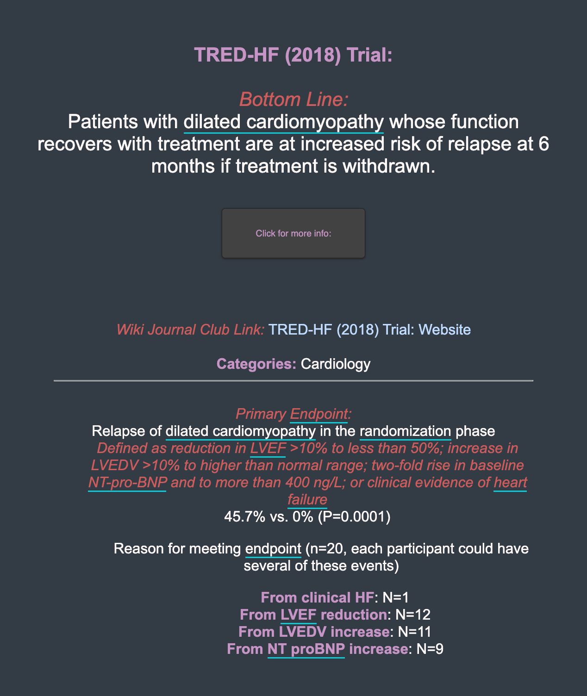
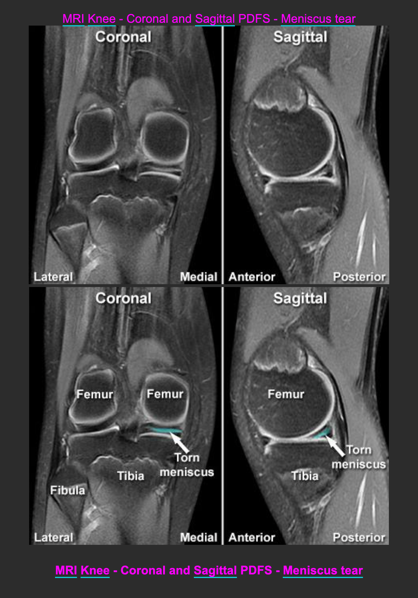

# Anki Webscraped Decks for Clinical Medicine:
A collection of anki decks for learning different aspects of clinical medicine. Each deck contains relevent subject/subspecialty tags and subdecks. 

- Wiki Journal Club Clinical Trials Deck: [Download Link](https://github.com/cole-khamnei/anki_webscraping/raw/main/anki_packages/WJC_clinical_trials.apkg)
- The Bottom Line Deck (Summaries similar to WJC): [Download Link]
- Radiology Masterclass: [Download Link](https://github.com/cole-khamnei/anki_webscraping/raw/main/anki_packages/radiology_images.apkg)

# <i>The Bottom Line</i> Clinical Trials Anki Deck

  An anki deck from The Bottom Line excellent summaries of clinical trials that uses the "bottom line" as the answer card. Many recent large trials are included (DanGer Shock, Acorn, ADVOR, etc). Will be updated routinely (all deck updates will be backwards compatible).   

Deck: <i> Not uploaded yet </i>
 
Source: https://www.thebottomline.org.uk/summaries/
 

# <i>Wiki Journal Club</i> Clinical Trials Anki Deck

  Another clinical trial anki deck from Wiki Journal Club's (WJC) excellent summaries that uses the "bottom line" as the answer card. WJC covers many large, must-know trials for different fields. WJC trials are often less recent than The Bottom Line.   

Deck: [Download Link](https://github.com/cole-khamnei/anki_webscraping/raw/main/anki_packages/WJC_clinical_trials.apkg)
 
Source: https://www.wikijournalclub.org
 

# Intro to Radiology Deck

  An anki deck from radiology masterclass website. Covers basic radiology examples (CXR, AXR, CT/MRI Head, MSK, etc).
 
 

Deck: [Download Link](https://github.com/cole-khamnei/anki_webscraping/raw/main/anki_packages/radiology_images.apkg)
 
Soource: https://www.radiologymasterclass.co.uk/gallery/galleries
 
